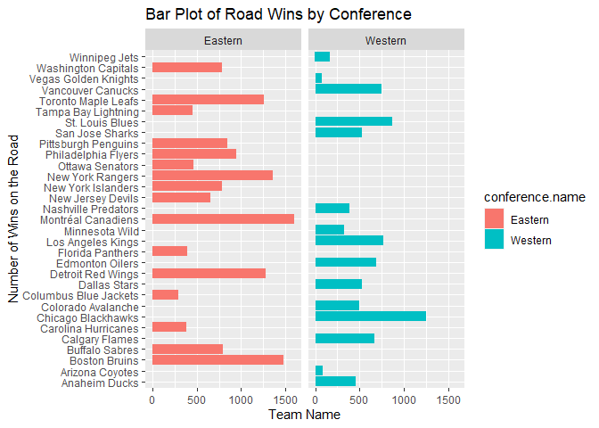
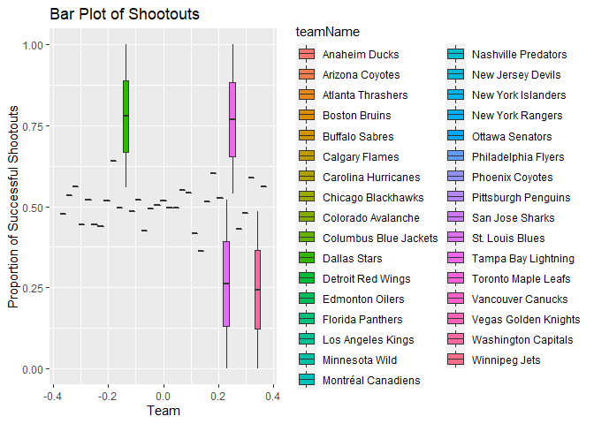
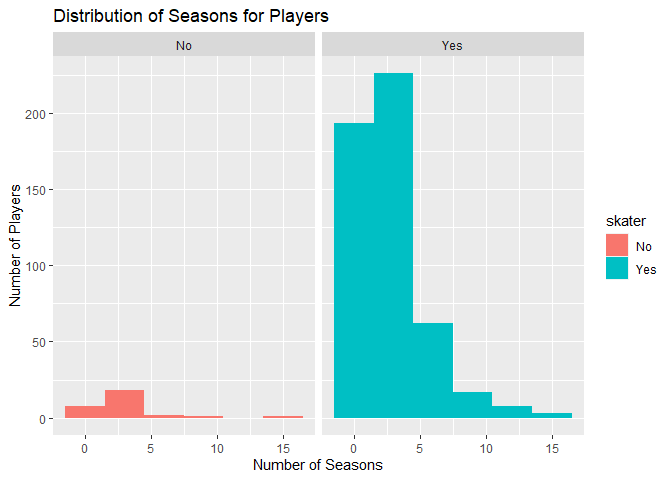
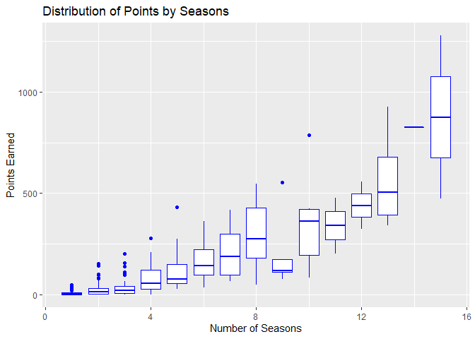
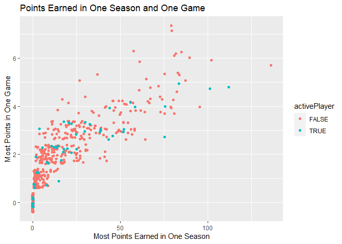
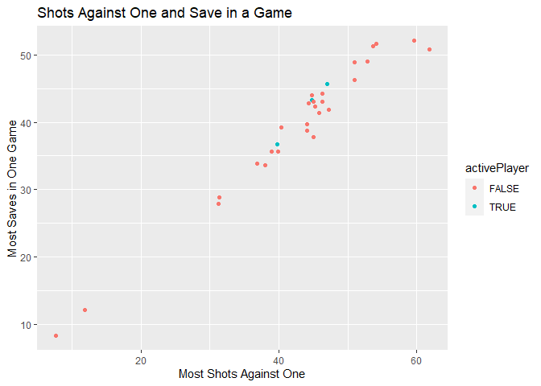
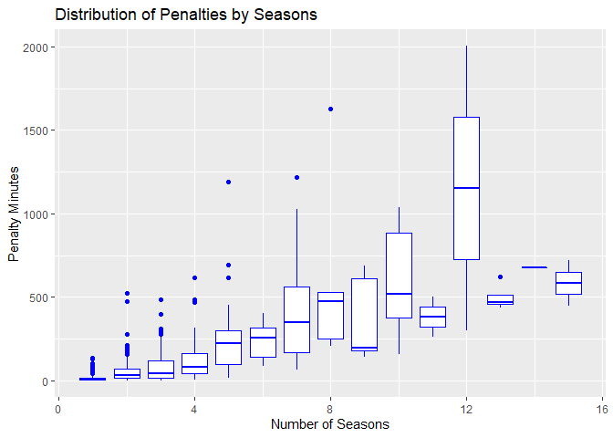

Project 1 Markdown
================
Rachel Keller
September 18, 2020

Requred Packages
================

Required packages for this vignette are `httr`, `jsonlite`, and
`tidyverse`. We will now load in these packages.

    library(httr)
    library(jsonlite)
    library(tidyverse)
    library(knitr)

Functions
=========

In this section, we will create the functions that will contact the NHL
Records API and NHL Stats API, and return parsed data for certain
endpoints.

Franchise Endpoint
------------------

The function below will return the franchise endpoint from the NHL
Records API, given either the team name or team number/id.

    getFranchise <- function(teamName = NA, teamNumber = NA){
      baseURLNHLRecords <- "https://records.nhl.com/site/api"
      tableName <- "franchise"
      fullURL <- paste0(baseURLNHLRecords, "/", tableName)
      get <- GET(fullURL)
      txt <- content(get, "text", encoding = "UTF-8")
      json <- fromJSON(txt, flatten = TRUE)
      if(is.na(teamName) & is.na(teamNumber)){
        result <- json$data
      }
      else if (is.na(teamName)){
        result <- json$data %>% mutate(fullName = paste(teamPlaceName, teamCommonName, sep = " ")) %>% filter(id == teamNumber)
      }
      else {
        result <- json$data %>% mutate(fullName = paste(teamPlaceName, teamCommonName, sep = " ")) %>% filter(fullName == teamName)
      }
      return(result)
    }

Franchise Team Totals
---------------------

The function below will return the franchise team totals endpoint from
the NHL Records API, given either the team name or team number/id.

    getFranchiseTotals <- function(teamName = NA, teamNumber = NA){
      baseURLNHLRecords <- "https://records.nhl.com/site/api"
      tableName <- "franchise-team-totals "
      fullURL <- paste0(baseURLNHLRecords, "/", tableName)
      get <- GET(fullURL)
      txt <- content(get, "text", encoding = "UTF-8")
      json <- fromJSON(txt, flatten = TRUE)
      if(is.na(teamName) & is.na(teamNumber)){
        result <- json$data
      }
      else if (is.na(teamName)){
        result <- json$data %>% filter(franchiseId == teamNumber)
      }
      else {
        teamNameValue <- teamName
        result <- json$data %>% filter(teamName == teamNameValue)
      }
      return(result)
    }

Franchise Season Records
------------------------

The function below will return the franchise season records endpoint
from the NHL Records API, given either the team name or team number/id.

    getFranchiseSeasonRecords <- function(teamName = NA, teamNumber = NA){
      baseURLNHLRecords <- "https://records.nhl.com/site/api"
      tableName <- "franchise-season-records?cayenneExp=franchiseId="
      if(is.na(teamName) & is.na(teamNumber)){
        result <- "Error, need to specify a franchise ID or name. "
      }
      else if (is.na(teamName)){
        id <- teamNumber
        fullURL <- paste0(baseURLNHLRecords, "/", tableName, id)
        get <- GET(fullURL)
        txt <- content(get, "text", encoding = "UTF-8")
        json <- fromJSON(txt, flatten = TRUE)
        result <- json$data
      }
      else {
        teamInfo <- getFranchise(teamName = teamName)
        id <- teamInfo$id
        fullURL <- paste0(baseURLNHLRecords, "/", tableName, id)
        get <- GET(fullURL)
        txt <- content(get, "text", encoding = "UTF-8")
        json <- fromJSON(txt, flatten = TRUE)
        result <- json$data
      }
      return(result)
    }

Franchise Goalie Records
------------------------

The function below will return the goalie records endpoint from the NHL
Records API, given either the team name or team number/id.

    getGoalieRecords <- function(teamName = NA, teamNumber = NA){
      baseURLNHLRecords <- "https://records.nhl.com/site/api"
      tableName <- "franchise-goalie-records?cayenneExp=franchiseId="
      if(is.na(teamName) & is.na(teamNumber)){
        result <- "Error, need to specify a franchise ID or name. "
      }
      else if (is.na(teamName)){
        id <- teamNumber
        fullURL <- paste0(baseURLNHLRecords, "/", tableName, id)
        get <- GET(fullURL)
        txt <- content(get, "text", encoding = "UTF-8")
        json <- fromJSON(txt, flatten = TRUE)
        result <- json$data
      }
      else {
        teamInfo <- getFranchise(teamName = teamName)
        id <- teamInfo$id
        fullURL <- paste0(baseURLNHLRecords, "/", tableName, id)
        get <- GET(fullURL)
        txt <- content(get, "text", encoding = "UTF-8")
        json <- fromJSON(txt, flatten = TRUE)
        result <- json$data
      }
      return(result)
    }

Franchise Skater Records
------------------------

The function below will return the skater records endpoint from the NHL
Records API, given either the team name or team number/id.

    getSkaterRecords <- function(teamName = NA, teamNumber = NA){
      baseURLNHLRecords <- "https://records.nhl.com/site/api"
      tableName <- "franchise-skater-records?cayenneExp=franchiseId="
      if(is.na(teamName) & is.na(teamNumber)){
        result <- "Error, need to specify a franchise ID or name. "
      }
      else if (is.na(teamName)){
        id <- teamNumber
        fullURL <- paste0(baseURLNHLRecords, "/", tableName, id)
        get <- GET(fullURL)
        txt <- content(get, "text", encoding = "UTF-8")
        json <- fromJSON(txt, flatten = TRUE)
        result <- json$data
      }
      else {
        teamInfo <- getFranchise(teamName = teamName)
        id <- teamInfo$id
        fullURL <- paste0(baseURLNHLRecords, "/", tableName, id)
        get <- GET(fullURL)
        txt <- content(get, "text", encoding = "UTF-8")
        json <- fromJSON(txt, flatten = TRUE)
        result <- json$data
      }
      return(result)
    }

Teams
-----

The function below will return the teams endpoint from the NHL Stats
API, given either the team name or team number/id.

    getTeams <- function(teamName = NA, teamNumber = NA, modifier = NA, modifierValue = NA){
      baseURLNHLStats <- "https://statsapi.web.nhl.com/api/v1"
      tableName <- "teams"
      switch(modifier,
                 "Team Roster"={
                   modifierURL <- "?expand=team.roster"
                 }, "Person Names"={
                   modifierURL <- "?expand=person.names"
                 }, "Next Schedule"={
                   modifierURL <- "?expand=team.schedule.next"
                 }, "Previous Schedule"={
                   modifierURL <- "?expand=team.schedule.previous"
                 }, "Team Stats"={
                   modifierURL <- "?expand=team.stats"
                 }, "Season Roster"={
                   modifierURL <- paste0("?expand=team.roster&season=", modifierValue)
                 }, "Multiple Teams"={
                   modifierURL <- "?teamId="
                 }, "Single Season Stats"={
                   modifierURL <- "?stats=statsSingleSeasonPlayoffs"
                 })
      if(is.na(teamName) & is.na(teamNumber)){
        fullURL <- paste0(baseURLNHLStats, "/", tableName)
        get <- GET(fullURL)
        txt <- content(get, "text")
        json <- fromJSON(txt, flatten=TRUE)
        result <- json$teams
      }
      else if (is.na(teamName)){
        fullURL <- paste0(baseURLNHLStats, "/", tableName)
        get <- GET(fullURL)
        txt <- content(get, "text")
        json <- fromJSON(txt, flatten=TRUE)
        if (is.na(modifier)){
          result <- json$teams %>% filter(franchiseId == teamNumber)
        } else {
          getId <- json$teams %>% filter(franchiseId == teamNumber)
          id <- getId$id
          URLWithModifier <- paste0(baseURLNHLStats, "/", tableName, "/", id, modifierURL)
          getModifier <- GET(URLWithModifier)
          text <- content(getModifier, "text")
          jsonFile <- fromJSON(text, flatten=TRUE)
          if (modifier == "Team Roster"){
            result <- jsonFile$teams$roster.roster
          } else if (modifier == "Previous Schedule"){
            result <- jsonFile$teams$previousGameSchedule.dates
          } else if (modifier == "Team Stats"){
            result <- jsonFile$teams$teamStats
          } else if (modifier == "Season Roster"){
            result <- jsonFile$teams$roster.roster
          }
          else {
            result <- jsonFile$teams
          }
        }
      }
      else {
        fullURL <- paste0(baseURLNHLStats, "/", tableName)
        get <- GET(fullURL)
        txt <- content(get, "text")
        json <- fromJSON(txt, flatten=TRUE)
        teamNameValue <- teamName
        if (is.na(modifier)){
          result <- json$teams %>% filter(name == teamNameValue)
        } else {
          getId <- json$teams %>% filter(name == teamNameValue)
          id <- getId$id
          URLWithModifier <- paste0(baseURLNHLStats, "/", tableName, "/", id, modifierURL)
          getModifier <- GET(URLWithModifier)
          text <- content(getModifier, "text")
          jsonFile <- fromJSON(text, flatten=TRUE)
          if (modifier == "Team Roster"){
            result <- jsonFile$teams$roster.roster
          } else if (modifier == "Previous Schedule"){
            result <- jsonFile$teams$previousGameSchedule.dates
          } else if (modifier == "Team Stats"){
            result <- jsonFile$teams$teamStats
          } else if (modifier == "Season Roster"){
            result <- jsonFile$teams$roster.roster
          }
          else {
            result <- jsonFile$teams
          }
        }
      }
      return(result)
    }

Wrapper
-------

Now, we will create our wrapper function. The user can select their
desired endpoint.

    getEndpoint <- function(endpoint, teamName = NA, teamNumber = NA, modifier = NA, modifierValue = NA){
      if(endpoint == "franchise"){
        result <- getFranchise(teamName, teamNumber)
      } else if (endpoint == "franchise totals"){
        result <- getFranchiseTotals(teamName, teamNumber)
      } else if (endpoint == "franchise season records"){
        result <- getFranchiseSeasonRecords(teamName, teamNumber)
      } else if (endpoint == "goalie records"){
        result <- getGoalieRecords(teamName, teamNumber)
      } else if (endpoint == "skater records"){
        result <- getSkaterRecords(teamName, teamNumber)
      } else if (endpoint == "teams"){
        result <- getTeams(teamName, teamNumber, modifier, modifierValue)
      } else {
        result <- "Error, incorrect endpoint."
      }
      return(result)
    }

Exploratory Data Analysis
=========================

Now that we have all of functions created to contact various endpoints
in our APIs, we will explore our data. We’ll begin by doing some
analysis for the overall NHL, then dive into analysis of the Washington
Capitals, my personal favorite. For both analyses, we will take a look
at a few measures that could indicate optimal team performance.

NHL Analysis
------------

First, we will look at a contingency table to get an idea about the
overall structure of the NHL.

    overallStructure <- getEndpoint("teams")
    kable(table(overallStructure$division.name, overallStructure$conference.name))

|              | Eastern | Western |
|--------------|--------:|--------:|
| Atlantic     |       8 |       0 |
| Central      |       0 |       7 |
| Metropolitan |       8 |       0 |
| Pacific      |       0 |       8 |

We can see that there are 16 active teams in the Eastern conceference, 8
in the Atlantic division and 8 in the Metropolitan division. And there
are 15 active teams in the Western conference, 7 in the Central division
and 8 in the Pacific division.

As conference standings are determined by points, we will create a
numeric summaries with the overall points.

    conferences <- getEndpoint("teams") %>% rename(teamId = id)
    points <- getEndpoint("franchise totals") %>% filter(gameTypeId == 2)
    conferencesPoints <- right_join(conferences, points, by = "teamId")
    conferencesPoints %>% group_by(name) %>% summarise(pointsEarned = points) %>% filter(!is.na(name))

    ## # A tibble: 31 x 2
    ## # Groups:   name [31]
    ##    name                  pointsEarned
    ##    <chr>                        <int>
    ##  1 Anaheim Ducks                 2224
    ##  2 Arizona Coyotes                434
    ##  3 Boston Bruins                 7391
    ##  4 Buffalo Sabres                4149
    ##  5 Calgary Flames                3360
    ##  6 Carolina Hurricanes           1834
    ##  7 Chicago Blackhawks            6556
    ##  8 Colorado Avalanche            2175
    ##  9 Columbus Blue Jackets         1500
    ## 10 Dallas Stars                  2395
    ## # ... with 21 more rows

    conferencesPoints %>% group_by(division.name) %>% summarise(sumPointsEarned = sum(points)) %>% filter(!is.na(division.name))

    ## # A tibble: 4 x 2
    ##   division.name sumPointsEarned
    ##   <chr>                   <int>
    ## 1 Atlantic                39126
    ## 2 Central                 19811
    ## 3 Metropolitan            29742
    ## 4 Pacific                 19822

Now that we have looked at points as a whole, we will look at the
average points per game in regular season.

    conferencesPoints %>% mutate(avgPoints = points / gamesPlayed) %>% group_by(name) %>% summarise(avg = mean(avgPoints)) %>% filter(!is.na(name))

    ## # A tibble: 31 x 2
    ##    name                    avg
    ##    <chr>                 <dbl>
    ##  1 Anaheim Ducks         1.08 
    ##  2 Arizona Coyotes       0.904
    ##  3 Boston Bruins         1.12 
    ##  4 Buffalo Sabres        1.07 
    ##  5 Calgary Flames        1.08 
    ##  6 Carolina Hurricanes   1.04 
    ##  7 Chicago Blackhawks    1.01 
    ##  8 Colorado Avalanche    1.13 
    ##  9 Columbus Blue Jackets 0.992
    ## 10 Dallas Stars          1.17 
    ## # ... with 21 more rows

    conferencesPoints %>% mutate(avgPoints = points / gamesPlayed) %>% group_by(division.name) %>% summarise(avg = mean(avgPoints), med = median(avgPoints), var = var(avgPoints))

    ## # A tibble: 5 x 4
    ##   division.name   avg   med     var
    ##   <chr>         <dbl> <dbl>   <dbl>
    ## 1 Atlantic      1.06  1.05  0.00384
    ## 2 Central       1.10  1.11  0.00259
    ## 3 Metropolitan  1.05  1.04  0.00224
    ## 4 Pacific       1.05  1.05  0.00923
    ## 5 <NA>          0.776 0.844 0.0499

Now, we will take some of the history of the league into account. To do
this, we will create a bar graph of home wins by division.

    teamInfo <- getEndpoint("teams") %>% rename(teamId = id)
    totals <- getEndpoint("franchise totals")
    teamInfoTotals <- right_join(teamInfo, totals, by = "teamId") %>% filter(!is.na(name), !is.na(conference.name))
    g <- ggplot(teamInfoTotals, aes(name, homeWins, fill = conference.name))
    g + geom_bar(stat = "identity") + facet_grid(~conference.name) + coord_flip() + labs(x = "Number of Wins at Home", y = "Team Name", title = "Bar Plot of Home Wins by Conference")

<!-- -->

Road wins by division

    g <- ggplot(teamInfoTotals, aes(name, roadWins, fill = conference.name))
    g + geom_bar(stat = "identity") + facet_grid(~conference.name) + coord_flip() + labs(x = "Number of Wins on the Road", y = "Team Name", title = "Bar Plot of Road Wins by Conference")

<!-- -->

More likely to win a shootout Franchise totals data Create boxplot
create new variable

    shootout <- getEndpoint("franchise totals") %>% mutate(propShootouts = shootoutWins / (shootoutWins + shootoutLosses), na.rm=TRUE)
    g <- ggplot(shootout, aes(X = teamName, y = propShootouts, fill = teamName))
    g + geom_boxplot() + labs(x = "Team", y = "Proportion of Successful Shootouts", title = "Bar Plot of Shootouts")

<!-- -->

Washington Capitals Analysis
----------------------------

Much like the analysis of the NHL, we will begin by creating some
contingency tables to gain some insight as to the layout of the
Capitals.

First, we will create a contingency table of the skater history.

    skaterHistory <- getEndpoint("skater records", teamName = "Washington Capitals")
    kable(table(Active = skaterHistory$activePlayer))

| Active | Freq |
|:-------|-----:|
| FALSE  |  457 |
| TRUE   |   52 |

And now we will create a similar contingency table of the goalie
history.

    goalieHistory <- getEndpoint("goalie records", teamName = "Washington Capitals")
    kable(table(Active = goalieHistory$activePlayer))

| Active | Freq |
|:-------|-----:|
| FALSE  |   27 |
| TRUE   |    3 |

There are currently 3 active goalies on the team. We will create another
contingency table that further drills down into the positions of the
current roster.

    currentRoster <- getEndpoint("teams", teamName = "Washington Capitals", modifier = "Team Roster")
    kable(table(Position = currentRoster[[1]][["position.name"]]))

| Position   | Freq |
|:-----------|-----:|
| Center     |    9 |
| Defenseman |   10 |
| Goalie     |    4 |
| Left Wing  |    6 |
| Right Wing |    5 |

The position with the most players is defensemen. Now we will start to
dig into the details of the players, first by seeing how seasoned they
are. To do this, we will create a histogram for skaters and goalies.

    skaterSeasons <- getEndpoint("skater records", teamName = "Washington Capitals") %>% mutate(skater = "Yes")
    goalieSeasons <- getEndpoint("goalie records", teamName = "Washington Capitals") %>% mutate(skater = "No")
    joinedSeasons <- full_join(skaterSeasons, goalieSeasons)
    g <- ggplot(joinedSeasons, aes(x = seasons, fill = skater))
    g + geom_histogram(binwidth = 3) + facet_wrap(~skater) + labs(x = "Number of Seasons", y = "Number of Players", title = "Distribution of Seasons for Players")

<!-- -->

Both goalies and skater distributions appear to be right skewed. There
are very few players who have a long career with the Capitals. I would
expect that having more seasoned and experienced players would lead to a
better performance outcome. We will test this by looking at boxplots of
the points for each number of seasons.

    g <- ggplot(joinedSeasons, aes(x = seasons, y = points, group = seasons))
    g + geom_boxplot(color = "blue") + labs(x = "Number of Seasons", y = "Points Earned", title = "Distribution of Points by Seasons")

<!-- -->

There is a steady upward trend. As players gain more experience and play
for more seasons, the points they earn are consistently higher. Or
alternatively, players who no longer earn higher points are drafted to
another team. Finally, we will look at the points earned for skaters, to
see if the Capitals are improving in their choice of skaters over time.

    seasonPoints <- getEndpoint("skater records", teamName = "Washington Capitals")
    g <- ggplot(seasonPoints, aes(x = mostPointsOneSeason, y = mostPointsOneGame, color = activePlayer))
    g + geom_jitter() + labs(x = "Most Points Earned in One Season", y = "Most Points in One Game", title = "Points Earned in One Season and One Game")

<!-- -->

The trend of both active and nonactive players appears to be very
similar. So the Capitals are not necessarily improving their choice of
skaters. Now, we will begin looking at some stats that may represent a
solid goalie.

    seasons <- getEndpoint("goalie records", teamName = "Washington Capitals")
    g <- ggplot(seasons, aes(x = mostShotsAgainstOneGame, y = mostSavesOneGame, color = activePlayer))
    g + geom_jitter() + labs(x = "Most Shots Against One", y = "Most Saves in One Game", title = "Shots Against One and Save in a Game")

<!-- -->

Finally, we will take a look at sportsmenship by looking at the penalty
minutes of players.

    g <- ggplot(joinedSeasons, aes(x = seasons, y = penaltyMinutes, group = seasons))
    g + geom_boxplot(color = "blue") + labs(x = "Number of Seasons", y = "Penalty Minutes", title = "Distribution of Penalties by Seasons")

<!-- -->
